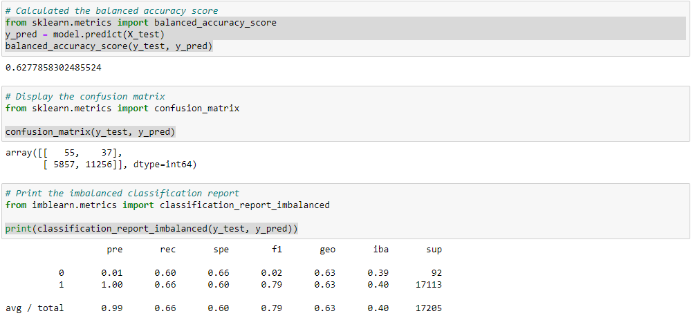
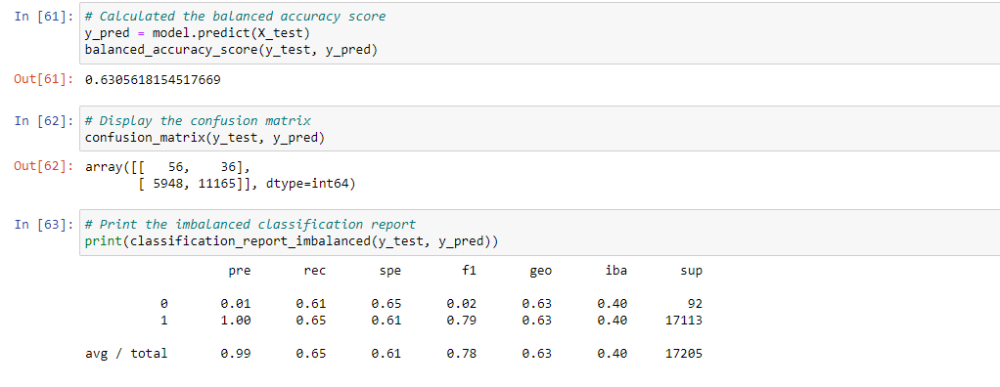
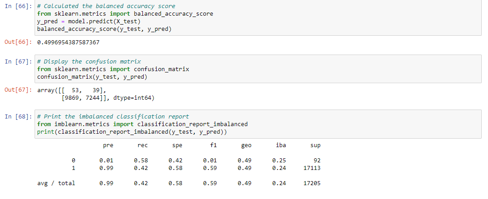
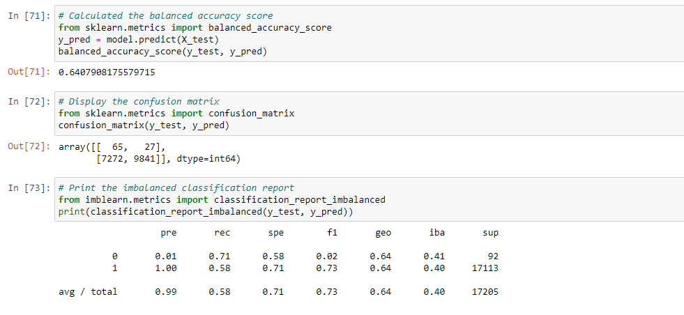
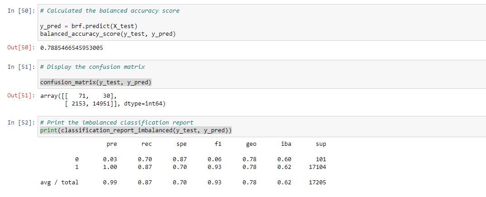
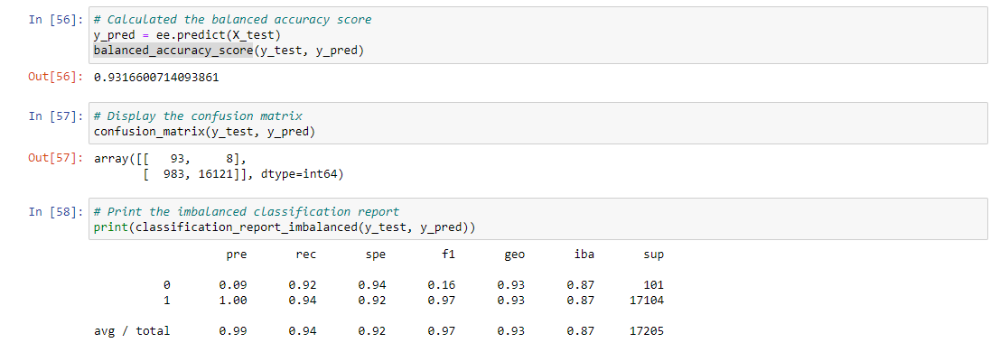

# Credit_Risk_Analysis

## Overview
This Analysis is being done to determine best machine learning algorithm that can be use to predict the credit risk in the credit card data presented.

## Results
- Naive Random Oversampling

- Balanced Accuracy – 0.627
- Precision 	– 0 - 0.01 
	      	- 1 – 1.00
- Recall 	– 0 - 0.60
	 	- 1 – 0.66

- SMOTE Oversampling

- Balanced Accuracy – 0.630
- Precision	– 0 - 0.01
	      	- 1 – 1.00
- Recall 	– 0 - 0.61
	 	- 1 – 0.65

- Cluster Centroids resampling

- Balanced Accuracy – 0.499
- Precision 	– 0 - 0.01 
	      	- 1 – 0.99
- Recall 	– 0 - 0.58
	 	- 1 – 0.42

- SMOTEENN Sampling

- Balanced Accuracy – 0.640
- Precision – 	0 - 0.01 
	      	    1 – 1.00
- Recall –  	  0 - 0.71
	 	          1 – 0.58

- Balanced Random Forest Classifier

- Balanced Accuracy – 0.78
- Precision – 	0 - 0.03 
	      	    1 – 1.00
- Recall –  	  0 – 0.70
	 	          1 – 0.87

- Easy Ensemble AdaBoost Classifier

- Balanced Accuracy – 0.93
- Precision – 	0 - 0.09
	      	    1 – 1.00
- Recall –  	  0 - 0.92
	 	          1 – 0.94

## Summary
-	The Results all the ML algorithm are very much near in terms of balanced accuracy except for the Balanced Random forest classifier. The best-balanced accuracy predicted out of all is by easy ensemble classifier with 93% accuracy
-	The Results of precision for all the algorithms can be seen the same for high risk =0.01 and low risk = 1.00 except for Easy ensemble which gives a precision of high risk as 9% and low risk as 100%.  Which is clearly more accurate considering 9% of the transactions being fraudulent.
-	The Results of the recall are somewhat very close to what precision was is displaying as only easy ensemble has more accurate with 92% high risk and 94% has low risk of fraudulent transactions
-	Base on these findings its safer to say that I recommend Easy Ensemble AdaBoost Classifier since the balanced accuracy is high to rely on the precision or recall.
